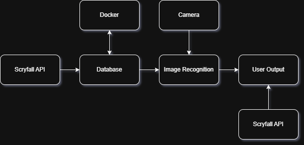

# mtg-collectors-helper
First try at creating an app that would help me keep my MTG collection in check.

Inspired by:
- [Scryfall API](https://scryfall.com/docs/api)
- [Zach Brown's article on Using Computer Vision to Catalogue Trading Cards](https://medium.com/@TheZachBrown/using-computer-vision-to-catalogue-trading-cards-c22981191149)

## Requirements

- Desktop/Mobile app (TBD)
- Use smartphone's camera to recognize MTG cards
- Show current price in EUR and PLN
- Save a list of owned cards
- Count the current worth of the collection

## Design:

